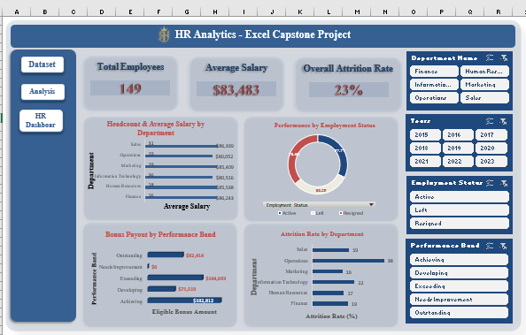

# **HR Analytics Dashboard using Microsoft Excel**


## **Overview**


This project demonstrates an end-to-end HR analytics workflow using Microsoft Excel. The objective was to transform raw employee records into an interactive dashboard that enables HR professionals to monitor workforce composition, employee performance, compensation, bonus allocation, and attrition across departments.


The project covers the complete analytics process, including data cleaning, transformation, exploratory data analysis, and dashboard development using Pivot Tables, Pivot Charts, Excel formulas, and interactive slicers.





## **Business Problem**


Human Resources departments require timely insights into workforce trends to support data-driven decision-making. However, raw employee data often contains inconsistencies, duplicate records, missing values, and coded fields that limit effective analysis.


This project addresses these challenges by cleaning the dataset, enriching it with calculated metrics, and developing an interactive dashboard that answers key HR questions related to employee distribution, salaries, performance, bonus projections, and employee attrition.


## **Project Workflow**


\### **Phase 1: Data Cleaning**


* Removed duplicate employee records.

* Standardized text values and data formats.

* Handled missing values.

* Resolved department codes using lookup tables.

* Corrected inconsistent employment status entries.


### **Phase 2: Data Transformation**


Created new analytical variables including:

* Full Name

* Department Name

* Years of Service

* Performance Band

* Eligible Bonus Amount


**Key Excel functions used include:**

\* XLOOKUP

\* IF

\* DATEDIF

\* TODAY

\* CONCAT

\* TRIM

\* PROPER

\* AVERAGE

\* COUNTIF


\### **Phase 3: Exploratory Data Analysis**


Pivot Tables were used to analyze:

\* Employee headcount by department

\* Average salary by department

\* Performance by employment status

\* Bonus payout by performance band

\* Attrition rate across departments


\### **Phase 4: Dashboard Development**


Designed an interactive HR dashboard featuring:

\* 3 KPI Cards (Total Employees, Average Salary, and Overall Attrition Rate)

\* Pivot Charts

\* Slicers for dynamic filtering


\# **Key Insights**

\* **Information Technology** employs the largest workforce (36), while **Finance** has the fewest employees (16).

\* Although salary differences across departments are relatively small, **Sales** reports the highest average employee salary ($86,339), whereas **Operations** records the lowest ($80,052).

\* **Active employees** consistently outperform employees who have left the organization, suggesting a possible relationship between employee engagement and retention.

\* The **Achieving** performance band contributes the largest share of projected bonus payouts ($192,812), while employees classified as **Needs Improvement** are ineligible for bonuses.

\* **Operations** experiences the highest attrition rate (38%), indicating potential retention challenges that may warrant further investigation.


\## **Dashboard Features**


The dashboard includes:

\* Total Employees KPI

\* Average Salary KPI

\* Overall Attrition Rate KPI

\* Employee Headcount by Department

\* Average Salary by Department

\* Performance by Employment Status

\* Bonus Payout by Performance Band

\* Attrition Rate by Department

\* Interactive slicers for dynamic analysis


\## Tools \& Technologies

\* Microsoft Excel

\* Pivot Tables

\* Pivot Charts

\* Excel Dashboard

\* Slicers

\* Lookup Tables


\## **Repository Structure**


```text

HR-Analytics-Dashboard/

│

├── HR\_Capstone\_Completed\_Khadijat\_Oyedeji.xlsx

├── README.md

└── images/

&#x20;   └── HR\_Dashboard.png


